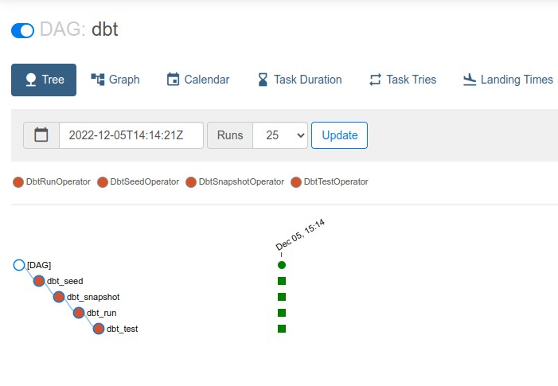
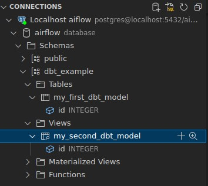

# SYNQ dbt Airflow example

## Prerequisites

To run this example you will need

- [docker](https://docs.docker.com/get-docker/)
- [kubectl](https://kubernetes.io/docs/tasks/tools/) (to manage kubernetes)
- [kind](https://kind.sigs.k8s.io/) (Kubernetes in docker)
- [helm](https://helm.sh/docs/intro/quickstart/) (package manager for Kubernetes)

Make sure that docker works:

```bash
docker version
```

## Installation

### Create local kubernetes cluster

If you don't have a kind cluster locally, please create it.

```bash
kind create cluster
kubectl cluster-info --context kind-kind
```

### Install Airflow with dbt support

In the next step we will install Airflow to our local Kubernetes cluster.

We will do that with Helm and we use airflow-helm chart for that https://github.com/airflow-helm/charts/tree/main/charts/airflow .

Before we install it you might want to edit [the Helm values.yml file](values.yml). The installations is configured in a way that it will periodically pull this repository with git from https://github.com/getsynq/synq-dbt-airflow.git and add it to the `dags` folder.


```bash
# Add the airflow helm repository
helm repo add airflow-stable https://airflow-helm.github.io/charts
# Install Airflow with helm using the values from values.yml
helm upgrade --install \
  "$AIRFLOW_NAME" \
  airflow-stable/airflow \
  --namespace "$AIRFLOW_NAMESPACE" \
  --version "8.6.1" \
  --values ./values.yml \
  --create-namespace \
  --wait
```
This can take a while (5 minutes).

### install Synq dbt

TBD

## How to use

### Connect to Airflow instance

To connect to Airflow in Kubernetes we have to port forward.

```bash
kubectl -n airflow port-forward service/airflow-web 8080
```

Open your browser http://localhost:8080

### Run the DAG

The dbt project has 2 simple models that will create one table and one view in the `airflow` database/`dbt_example` schema.

Click on the trigger DAG (red `1` circle)


After a few seconds the DAG should complete successful.




### Connect to Postgresql

`kubectl -n airflow port-forward service/airflow-postgresql 5432`

You can now use your database client to inspect the database.




## Deletion

If you want to delete the whole setup, you just need to delete the kind cluster with:
`kind delete cluster`
